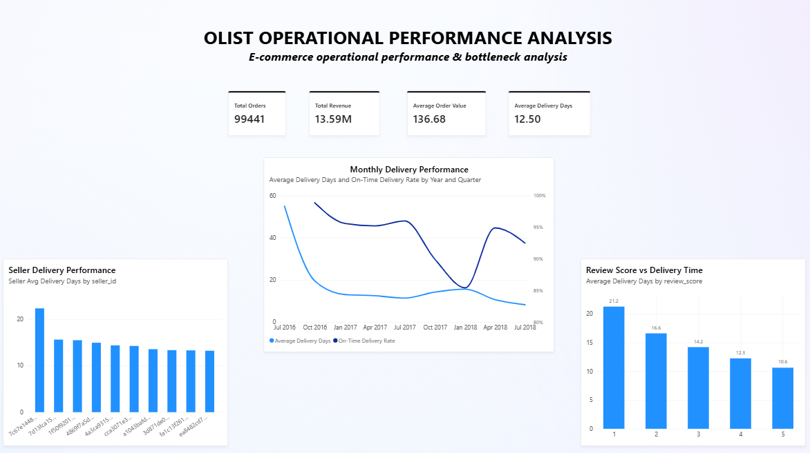

# Olist Operational Performance Analysis

## Project Overview

An end-to-end data analytics project focused on identifying operational performance patterns and potential bottlenecks in an e-commerce operation.

The project combines **Excel, SQL Server, Power BI, and DAX** to analyze order volume, revenue, delivery performance, seller performance, and customer review scores.

## Business Question

**Where does operational performance deteriorate, and what factors are associated with it?**

## Dataset

The project uses the **Brazilian Olist e-commerce dataset**, containing approximately 100,000 orders and multiple related tables covering orders, order items, reviews, sellers, customers, products, and payments.

The dataset represents historical e-commerce transactions and is used for analytical and portfolio purposes.

## Tools

* Excel
* SQL Server
* Power BI
* DAX

## Analysis Areas

* Order and revenue performance
* Delivery time and on-time delivery
* Seller delivery bottlenecks
* Review score vs. delivery time
* Monthly operational trends

## Key Findings

* The dataset contains **99,441 orders** and approximately **13.59M in item revenue**.
* Average delivery time is approximately **12.5 days**.
* Approximately **91.9% of delivered orders were delivered on time**.
* Delivery performance varies across sellers, with some high-volume sellers showing longer average delivery times.
* Lower review scores are associated with longer delivery times.
* Longer delivery times and lower on-time delivery rates were observed during parts of late 2017 and early 2018.

## Business Insights

The analysis highlights several areas that may require further operational investigation:

* High-delay sellers can be examined for potential fulfillment or logistics-related issues.
* Delivery performance and customer review scores should be monitored together.
* Monthly monitoring can help identify periods of declining delivery performance.
* Seller volume and delivery performance can be evaluated together to prioritize operational bottlenecks.

## Business Recommendations

1. **Investigate high-delay sellers**
   Review high-volume sellers with longer delivery times to identify potential operational issues.

2. **Monitor delivery and customer satisfaction together**
   Track delivery performance alongside customer review scores to identify potential relationships between operational performance and customer satisfaction.

3. **Establish monthly operational monitoring**
   Regularly monitor average delivery time and on-time delivery rate to detect changes in performance.

4. **Prioritize operational bottlenecks**
   Evaluate seller volume together with delivery performance to focus further investigation on areas with meaningful operational impact.

## Dashboard



## Project Structure

```text
Olist-Operational-Performance-Analysis/
│
├── sql/
│   ├── 01_data_exploration.sql
│   ├── 02_kpi_analysis.sql
│   └── 03_bottleneck_analysis.sql
│
├── operational_performance.pbix
│
├── dashboard.png
│
└── README.md
```

## Notes

The findings describe patterns and associations observed in the dataset and should not be interpreted as causal relationships.
